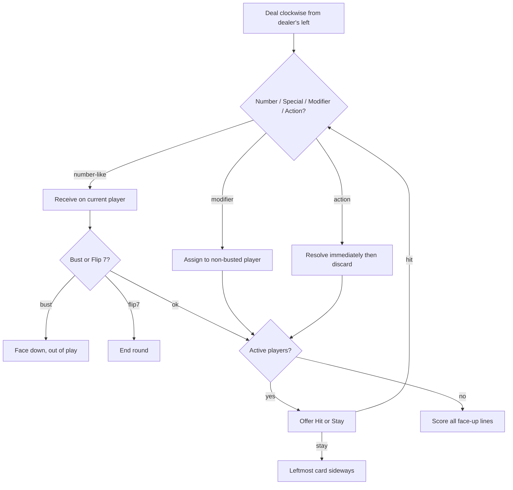

# Flip 7: With a Vengeance Domain Model (DDD in Go)

This document is the design blueprint for the **Flip 7: With a Vengeance** bounded context. It is the Vengeance counterpart of [`docs/domain_model.md`](../domain_model.md). Do not extend the original `Flip7Game` types with Vengeance cards or rules.

Primary rules source: [Flip 7 With a Vengeance Rules (Ruleset Edition 1)](https://cdn.shopify.com/s/files/1/0611/3958/3198/files/26_FLIP_7_VENGEANCE_RULES_C.pdf?v=1770853609). Interpretations are frozen in [`docs/vengeance/rules.md`](rules.md). If this model and the rules file disagree, the rules file wins.

Key DDD principles applied:

- **Bounded Context**: `Flip7Vengeance` — full game lifecycle (rounds, players, deck, take-that resolution). Isolated from `Flip7Game`.
- **Ubiquitous Language**: Hit, Stay, Bust, Active, Flip 7, Special Number, Just One More, Flip Four, Swap, Steal, Discard. "Frozen" and "Second Chance" are not in this language.
- **Aggregates**: `Game` (session consistency), `Round` (end conditions, table-card identity, delayed Flip Four resolution).
- **Focus on Counting/Strategy**: the deck tracks remaining counts of **every** card kind (not only number ranks), because EV and targeting need Zero / Unlucky 7 / ÷2 / Steal odds.

The model supports 3+ players, up to 18 (or more with a second deck), ages 8+, ~20 min. Goal: first to 200 points after a round ends. Cards in a line are not safe until the round ends.

Package (implementation issue #96): `internal/vengeance/domain`. Do not import `flip7_strategy/internal/domain`.

## Why a separate context

Original Flip 7 actions target **players** (Freeze, Flip Three, Second Chance). Vengeance actions often target **face-up cards on the table** (Swap, Steal, Discard), modifiers are assigned to other players, and Special Number effects start/stop with possession. Mixing those invariants into `PlayerHand.AddCard` / `ActionFreeze` would break original simulations.

Shared ideas only:

- Hit / Stay / Bust / Active / Flip 7 / 200-point race
- Dealer rotation and mid-round reshuffle (leave table cards in place)
- Strategy Pattern (interchangeable AI), with a wider decision surface

## Deck composition (108 cards)

Working count so that the box "108 CARDS" matches the printed sheet and the text "thirteen 13's … one 1":

| Card | Kind | Copies |
| :--- | :--- | ---: |
| 13 (regular) | Number | 12 |
| 12 | Number | 12 |
| 11 | Number | 11 |
| 10 | Number | 10 |
| 9 | Number | 9 |
| 8 | Number | 8 |
| 7 (regular) | Number | 6 |
| 6 | Number | 6 |
| 5 | Number | 5 |
| 4 | Number | 4 |
| 3 | Number | 3 |
| 2 | Number | 2 |
| 1 | Number | 1 |
| The Zero (0) | Special Number | 1 |
| Unlucky 7 | Special Number | 1 |
| Lucky 13 | Special Number | 1 |
| −2, −4, −6, −8, −10, ÷2 | Modifier | 1 each (6) |
| Just One More, Flip Four, Swap, Steal, Discard | Action | 2 each (10) |

Regular 13×12 + Lucky 13 = thirteen 13's. Regular 7×6 + Unlucky 7 = seven 7's. There is no regular 0.

Totals: 89 regular numbers + 3 specials + 6 modifiers + 10 actions = **108**.

## Mapping from original Flip 7

| Original (`Flip7Game`) | Vengeance (`Flip7Vengeance`) |
| :--- | :--- |
| Number 0–12 (0×1, n×n) | Number 1–13 (7×6, 13×12) + three Special Numbers |
| `+2`…`+10`, `×2` | `−2`…`−10`, `÷2` |
| Freeze, Flip Three, Second Chance (×3) | Just One More, Flip Four, Swap, Steal, Discard (×2) |
| `HandStatusFrozen` | absent; Stay leaves cards in the round |
| Second Chance stays in hand | Actions are single-use and discarded after resolve |
| Score: `(sum × ×2) + additives + 15` | Score: `floor(sum / 2 if ÷2) − subtractives`, min 0, then +15 |
| Action target = player | Player target (Just One More, Flip Four, Modifier) **and** card target (Swap, Steal, Discard) |
| Duplicate number → bust (unless Second Chance) | Duplicate rank → bust, except Lucky 13 allows a second 13; Unlucky 7 does not bust **on receipt** |
| Bank on Stay / Freeze / Flip 7 | Bank only at **round end** (Stay does not lock the line) |

## Core Domain Concepts

### Value Objects

Value objects are immutable structs without identity. **Physical cards on the table are not value objects**; see `TableCard` under Entities.

**CardSpec**  
Description: What a card *is* (rank, modifier, action). Used for deck construction, remaining counts, and display. Immutable.

```go
type CardType string // "number", "special_number", "modifier", "action"

type NumberValue int // 0 (The Zero) through 13

type SpecialKind string
const (
    SpecialNone     SpecialKind = ""
    SpecialZero     SpecialKind = "the_zero"
    SpecialUnlucky7 SpecialKind = "unlucky_7"
    SpecialLucky13  SpecialKind = "lucky_13"
)

type ModifierType string
const (
    ModifierMinus2  ModifierType = "minus_2"
    ModifierMinus4  ModifierType = "minus_4"
    ModifierMinus6  ModifierType = "minus_6"
    ModifierMinus8  ModifierType = "minus_8"
    ModifierMinus10 ModifierType = "minus_10"
    ModifierDivide2 ModifierType = "divide_2"
)

type ActionType string
const (
    ActionJustOneMore ActionType = "just_one_more"
    ActionFlipFour    ActionType = "flip_four"
    ActionSwap        ActionType = "swap"
    ActionSteal       ActionType = "steal"
    ActionDiscard     ActionType = "discard"
)

type CardSpec struct {
    Type         CardType
    Value        NumberValue  // numbers and specials
    SpecialKind  SpecialKind  // empty for regular numbers
    ModifierType ModifierType
    ActionType   ActionType
}

func (c CardSpec) IsNumberLike() bool // number or special_number
func (c CardSpec) Rank() (NumberValue, bool)
func (c CardSpec) CountsTowardFlip7() bool // number-like only
```

**PointValue**  
Description: Immutable score breakdown. Formula is owned by `ScoreCalculator`.

```go
type PointValue struct {
    BaseSum              int  // sum of number-like ranks (Zero contributes 0)
    Divided              bool // ÷2 was applied
    AfterDivide          int  // floor(BaseSum / 2) or BaseSum
    SubtractedModifiers  []int // e.g. [-4]
    AfterModifiers       int  // max(0, AfterDivide + sum(subtracted))
    ZeroOverride         bool // The Zero held and Flip 7 not achieved → Total 0
    Bonus                int  // 15 if Flip 7
    Total                int
}
```

**HandStatus**

```go
type HandStatus string // "active", "stayed", "busted"
```

There is no `"frozen"`. Stay turns the leftmost number-like card sideways; the line stays in the round and remains targetable.

**TurnChoice**

```go
type TurnChoice string // "hit", "stay"
```

**RoundEndReason**

```go
type RoundEndReason string // "no_active_players", "flip7_achieved"
```

**CardRef / SwapPair**  
Description: Strategy and resolvers point at a table card by identity, not by "the 12 in Alice's hand" as a value.

```go
type CardID uuid.UUID

type CardRef struct {
    ID       CardID
    OwnerID  uuid.UUID
}

type SwapPair struct {
    A CardRef
    B CardRef
}
```

### Entities

Entities have identity and mutable state.

**TableCard**  
Description: One physical card. Identity is assigned at `DeckFactory` so Steal / Swap / Discard can name it. Face-down busted cards are out of play (standard rules).

```go
type TableCard struct {
    ID       CardID
    Spec     CardSpec
    FaceUp   bool
    Sideways bool // Stay marker; only the leftmost number-like card of a stayed hand
}
```

**Player**  
Description: Participant with a running score and a pluggable strategy.

Key methods: `StartNewRound()`, `BankScore(score int)`, `IsWinner() bool`

```go
type Player struct {
    ID          uuid.UUID
    Name        string
    TotalScore  int
    CurrentHand *PlayerHand
    Strategy    Strategy
}
```

**PlayerHand**  
Description: One player's line for the current round. Number-like cards sit in left-to-right order (Stay marks the leftmost). Modifiers sit above the numbers and do not count toward Flip 7. Actions are **not** stored in the hand after resolution.

Key methods:

- `ReceiveNumberLike(card TableCard) ReceiveResult` — uniqueness, Lucky 13, Unlucky 7 wipe, Zero, Flip 7
- `ReceiveModifier(card TableCard)`
- `RemoveCard(id CardID) (TableCard, error)` — Steal / Swap / Discard / Unlucky 7 wipe
- `HasLucky13() bool`, `HasZero() bool`, `MustHit() bool`
- `DistinctRanks() int`
- `CanStay() bool` — false when `MustHit()` (The Zero), except after a Just One More force-Stay (rules.md #8)
- `FaceUpCards() []TableCard` — legal targets while not busted

```go
type PlayerHand struct {
    ID           uuid.UUID
    NumberLine   []TableCard // ordered; specials live here
    ModifierLine []TableCard
    Status       HandStatus
}

type ReceiveResult struct {
    Busted    bool
    Flip7     bool
    Wiped     []TableCard // cards discarded by Unlucky 7
    Kept      *TableCard  // Unlucky 7 itself, if that was the received card
}
```

Uniqueness (rules.md):

- Regular ranks bust on a second copy.
- Rank 13 may appear twice **iff** Lucky 13 is in this hand when the second 13 is received (either order). A third 13 busts.
- Receiving Unlucky 7 never busts. Wipe every number-like card and every modifier, then keep Unlucky 7 only. If this happens mid Flip Four, wipe first, then continue remaining flips.
- Drawing a regular 7 while Unlucky 7 is already in the line **does** bust (protection is on receipt of Unlucky 7 only).
- The Zero counts as rank 0 toward Flip 7 and forces Hit on that player's own turn while possessed. Just One More force-Stay overrides Must Hit. Effect ends if Zero is stolen / swapped / discarded away.

Flip 7: **seven distinct ranks** in `NumberLine`. Two 13s are one rank; both still score.

**Round**  
Description: One dealing until everyone has busted or stayed, or someone Flips 7.

Key methods: `DealInitialCards()`, `PlayerTurn(player, choice)`, `CheckEndConditions()`, face-up card index for targeting.

```go
type Round struct {
    ID               uuid.UUID
    Dealer           *Player
    Players          []*Player
    Deck             *Deck
    DiscardPile      []TableCard
    ActivePlayers    []*Player
    CurrentTurnIndex int
    Pending          []PendingResolve // Flip Four delayed actions/modifiers
    IsEnded          bool
    EndReason        RoundEndReason
}

type PendingResolve struct {
    Card  TableCard
    Actor *Player // player who must resolve it (the Flip Four target)
}
```

**Game**  
Description: Aggregate root until 200 points.

```go
type Game struct {
    ID           uuid.UUID
    Players      []*Player
    CurrentRound *Round
    DealerIndex  int
    IsCompleted  bool
    Winners      []*Player
    DiscardPile  []TableCard
    RoundCount   int
    Deck         *Deck
}
```

Tie-break when several players are ≥200: highest score wins; all tied highest scores are `Winners` (same as original `DetermineWinners`; rules.md #15).

### Aggregates

**Game Aggregate**

- Contained: `Players`, current `Round`, leftover `Deck`, `DiscardPile`
- Invariants:
  - Game ends only **after a round**, when at least one player has ≥200. Highest total wins.
  - Dealer rotates left (pass remaining deck left).
  - Scores are banked only at round end. Stay does not bank. There is no Freeze.
  - Standard mode: round score cannot go below zero (`PointValue.Total >= 0`).

**Round Aggregate**

- Contained: each `PlayerHand` (table cards), `Deck`, `DiscardPile`, `Pending`
- Invariants:
  - Initial deal **and** later Hit/Stay offers: clockwise from the player to the dealer's left. Action / Modifier pause and resolve immediately.
  - Active = not stayed and not busted.
  - Stay: leftmost number-like card sideways; player leaves `ActivePlayers` but line stays face up.
  - Bust: all of that player's cards face down; out of play (not Steal/Swap/Discard targets). Status `busted`. Score 0 this round.
  - Ends when no active players remain, or one player achieves Flip 7 (round ends immediately).
  - Reshuffle if the deck is empty: shuffle **discard pile only**; cards in front of players stay, including busted players' face-down cards.
  - Action / Modifier targets: any player who has not busted (Stay included, self included). If the actor is the only non-busted player, the card must be applied to self. Actions are discarded after play.
  - If Swap / Steal / Discard is revealed at the start of a round and there is no legal face-up card, discard the action without effect.
  - A stayed player who receives an Action must resolve it and does **not** re-enter Active.
  - **Flip Four**: target accepts the next four cards, one at a time. Stop early on Flip 7 or bust. Number, Action, and Modifier all count toward the four. Delayed Action / Modifier resolve in draw order only if the target neither busted nor Flipped 7. Unlucky 7 mid Flip Four: wipe previous cards first, then finish remaining flips.
  - **Just One More**: target accepts the next one card; if it is an Action, the **target** resolves it; then the target must Stay.



## Domain Services

Stateless (or round-scoped) services for cross-entity rules.

**ScoreCalculator**

```go
type ScoreCalculator interface {
    Compute(hand *PlayerHand) PointValue
}
```

Order (PDF example: 3+11+5+7+10+8+4 = 48, ÷2 → 24, −4 → 20, Flip 7 +15 → 35):

1. Sum number-like ranks (`BaseSum`).
2. If ÷2 is in the modifier line, `AfterDivide = floor(BaseSum / 2)`.
3. Subtract −2…−10. `AfterModifiers = max(0, AfterDivide + negativeSum)` (standard mode).
4. If Flip 7, add 15.
5. If The Zero is in the line and Flip 7 is **not** achieved: `Total = 0`. Zero does not override steps 1–4 when Flip 7 is achieved.

Busted hands always score 0.

**ActionResolver**

```go
type ActionResolver interface {
    Resolve(round *Round, actor *Player, card TableCard, decision ActionDecision) error
}

type ActionDecision struct {
    PlayerTarget *Player  // Just One More, Flip Four
    CardTarget   *CardRef // Steal, Discard
    Swap         *SwapPair
}
```

- Just One More / Flip Four: player target among non-busted; self if no one else.
- Steal: one face-up card on the table; add to **actor's** line via `ReceiveNumberLike` / `ReceiveModifier` (receiving Zero / Unlucky 7 / Lucky 13 / a 13 / a duplicate applies immediately).
- Discard: one face-up card; move to discard pile; former owner's special effects stop.
- Swap: two face-up cards on **two different** players (self↔other or other↔other). Same line is illegal. Number↔Modifier is legal. Each recipient `Receive*`s the incoming card after `RemoveCard`.

**ModifierAssigner**

```go
type ModifierAssigner interface {
    Assign(round *Round, actor *Player, card TableCard, target *Player) error
}
```

Target must be non-busted (Stay allowed). If actor is the only non-busted player, target must be actor.

**DeckFactory**

```go
type DeckFactory interface {
    NewDeck(multiDeck bool) *Deck // 108, or 216 if multiDeck
}
```

Every `TableCard` gets a fresh `CardID` here.

**Strategy** (Strategy Pattern)

Hit/Stay is not enough. Targeting is card-level.

```go
type Strategy interface {
    Name() string
    Decide(ctx DecisionContext) TurnChoice
    ChoosePlayerTarget(action ActionType, candidates []*Player, self *Player) *Player
    ChooseModifierTarget(mod ModifierType, candidates []*Player, self *Player) *Player
    ChooseCardTarget(action ActionType, faceUp []CardRef, self *Player) *CardRef
    ChooseSwapPair(faceUp []CardRef, self *Player) *SwapPair
}

type DecisionContext struct {
    Deck         *Deck
    Hand         *PlayerHand
    PlayerScore  int
    OtherPlayers []*Player
}
```

`TargetSelector` remains a separate component (same idea as original `DefaultTargetSelector`) so Hit/Stay strategies can swap targeting policies:

```go
type TargetSelector interface {
    ChoosePlayerTarget(action ActionType, candidates []*Player, self *Player) *Player
    ChooseModifierTarget(mod ModifierType, candidates []*Player, self *Player) *Player
    ChooseCardTarget(action ActionType, faceUp []CardRef, self *Player) *CardRef
    ChooseSwapPair(faceUp []CardRef, self *Player) *SwapPair
    SetDeck(deck *Deck)
}
```

Stub strategies for the implementation issue may return Stay (except `MustHit`) and a legal random target. Real policies belong in issue #94.

## Deck (mutable remaining counts)

```go
type RemainingCounts struct {
    ByNumber   map[NumberValue]int // regular copies only (13 → 12, 7 → 6, …)
    BySpecial  map[SpecialKind]int
    ByModifier map[ModifierType]int
    ByAction   map[ActionType]int
}

type Deck struct {
    Cards     []TableCard
    Remaining RemainingCounts
}

func (d *Deck) Draw() (TableCard, error)
func (d *Deck) Shuffle()
func (d *Deck) EstimateHitRisk(hand *PlayerHand) float64
```

`EstimateHitRisk` is not the original "sum remaining[rank] / total":

- Rank 13 is not a bust card while the hand has Lucky 13 and only one 13.
- Unlucky 7 is never a bust-on-receive card; treat it as a wipe, not a duplicate 7, for risk.
- The Zero is not a bust card; it is a score/MustHit shock.

Flip Four risk should be a Monte Carlo over four draws plus delayed action resolution (implementation detail; original used 1000 trials for Flip Three).

`NewDeckFromCards` rebuilds `Remaining` from a discard pile for reshuffle.

## Repositories (infrastructure)

Same shape as original; implementations live under `internal/vengeance` if needed.

```go
type GameRepository interface {
    Save(game *Game) error
    Load(id uuid.UUID) (*Game, error)
}
```

## Implementation notes for Go

- **Packages**: `internal/vengeance/domain`, `internal/vengeance/application`, later `internal/vengeance/domain/strategy`. Original `cmd/flip7` modes stay on `internal/domain`.
- **UUID**: `github.com/google/uuid` for `Player`, `PlayerHand`, `Round`, `Game`, and `CardID`.
- **Immutability**: `CardSpec` and `PointValue` are values. `TableCard` is an entity.
- **No original imports**: duplicate small enums rather than aliasing `domain.ActionFreeze`.
- **Testing invariants** (implementation issue):
  - New deck length 108 and per-card counts in the table above
  - Official score example 48 → 24 → 20 → 35
  - Lucky 13: second 13 OK, third busts
  - Unlucky 7: no bust on receive; wipe; Flip Four continues
  - Zero: `CanStay() == false` while possessed
  - Stay leaves cards face up; bust turns them down
  - Swap/Steal/Discard with empty table at deal time → discard action
  - Original `go test ./...` still passes
- **Brutal Mode**: out of this model. Future flags only — score may go negative; busted players may receive cards; Flip 7 may subtract 15 from another player instead of adding 15. Do not encode those in `ScoreCalculator` / `ActionResolver` until a follow-up issue.

## Interpretations

All former open questions are frozen in [`rules.md`](rules.md) (Adopted interpretations). Implementation (#96) tests the invariant list in that file.

This Markdown model is the blueprint for `internal/vengeance/domain`. Do not import original `internal/domain`.
